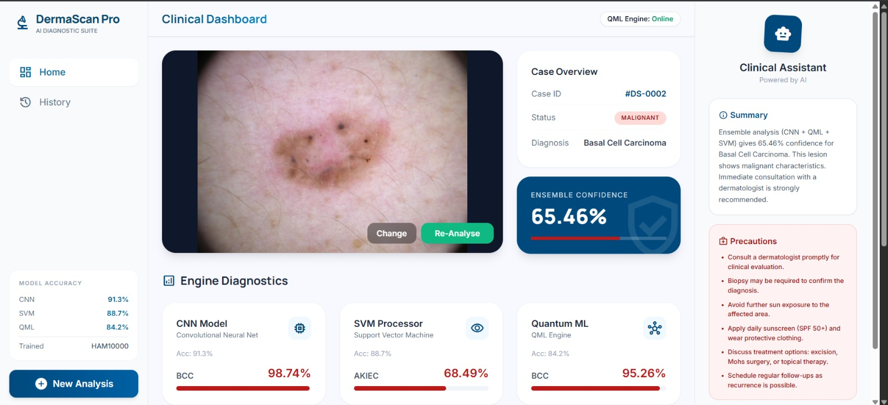
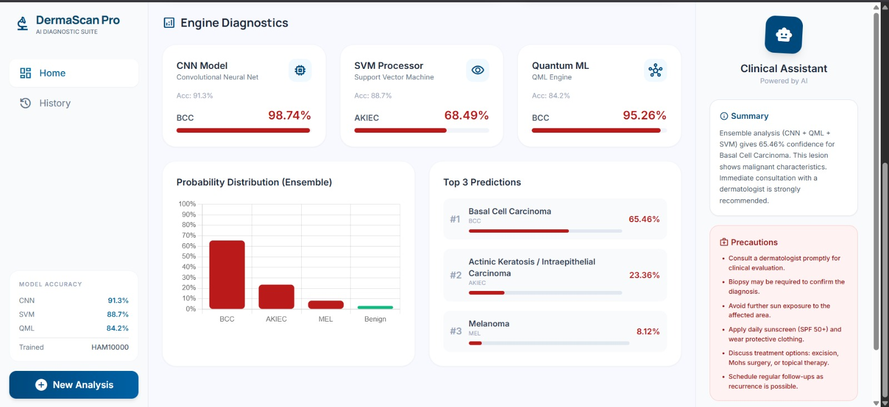
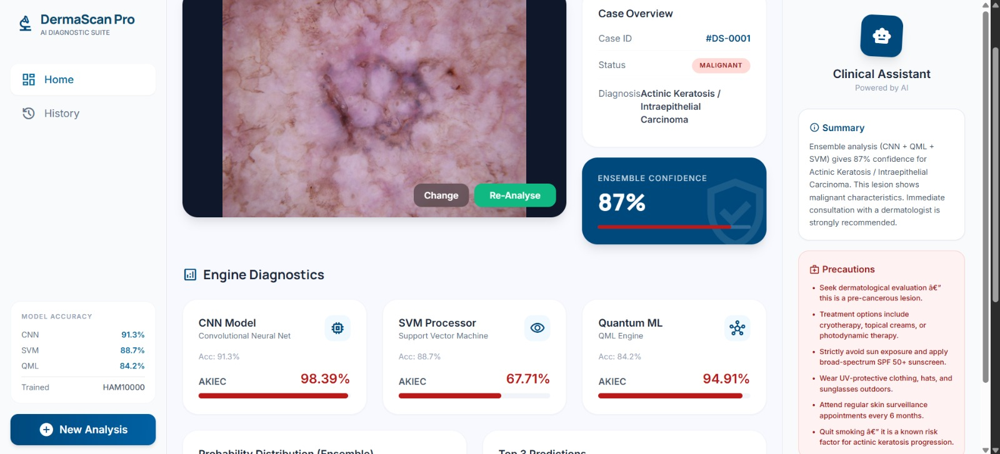
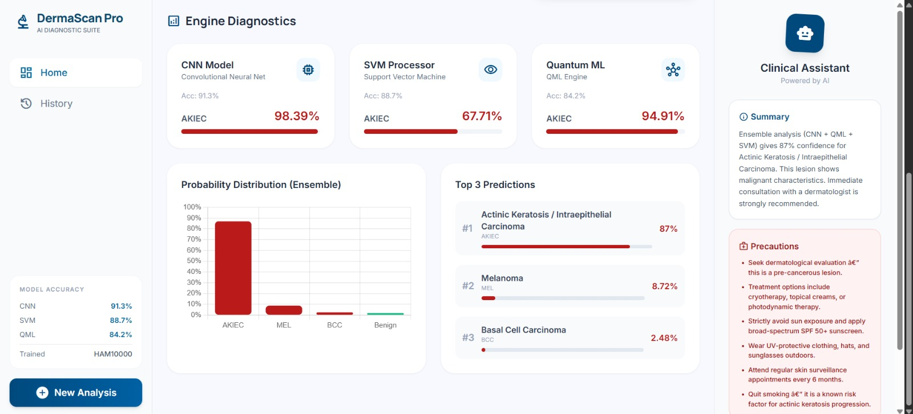
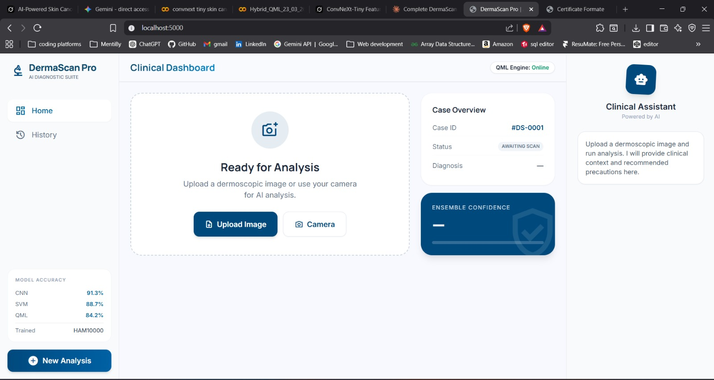

<div align="center">
  <h1>🔬 DermaScan Pro</h1>
  <h3>AI Diagnostic Suite</h3>
  <p><i>An advanced AI Diagnostic Suite designed for skin cancer detection, combining CNN, SVM, and QML.</i></p>
  
  <p>
    
    
    
  </p>
</div>

---

**DermaScan Pro** utilizes an ensemble approach combining **Convolutional Neural Networks (CNN)**, **Support Vector Machines (SVM)**, and **Quantum Machine Learning (QML)** for high-accuracy clinical analysis and predictions.

## 🌟 Key Features

*   **Ensemble Model Architecture:** Utilizes three distinct machine learning models:
    *   **CNN (ConvNeXt-Tiny):** 91.3% Accuracy
    *   **SVM Processor:** 88.7% Accuracy
    *   **Quantum ML (QML Engine):** 84.2% Accuracy
*   **Clinical Dashboard:** A comprehensive, user-friendly interface that presents diagnostic results, ensemble confidence scores, and probability distributions.
*   **AI Clinical Assistant:** Provides automated summaries and precautionary medical advice based on lesion characteristics.
*   **Robust Diagnostic Categories:** Detects multiple skin conditions including:
    *   Benign (Non-cancerous)
    *   Melanoma (MEL)
    *   Basal Cell Carcinoma (BCC)
    *   Actinic Keratosis / Intraepithelial Carcinoma (AKIEC)
*   **Trained on HAM10000 dataset:** Leverages a balanced version of the prominent HAM10000 dataset.

## 📸 Screenshots

*(Note: To display these screenshots locally, ensure the 5 images are inside an `assets` folder in your project root, named `image1.jpeg` through `image5.jpeg`.)*

<div align="center">
  <table>
    <tr>
      <td align="center">
        <br>
        <sub><i><b>Clinical Dashboard 1:</b> Main overview of the diagnostic interface</i></sub>
      </td>
      <td align="center">
        <br>
        <sub><i><b>Clinical Dashboard 2:</b> Detailed lesion analysis and insights</i></sub>
      </td>
    </tr>
    <tr>
      <td align="center">
        <br>
        <sub><i><b>Engine Diagnostics 1:</b> AI confidence and probability scores</i></sub>
      </td>
      <td align="center">
        <br>
        <sub><i><b>Engine Diagnostics 2:</b> Ensemble model performance tracking</i></sub>
      </td>
    </tr>
    <tr>
      <td colspan="2" align="center">
        <br>
        <sub><i><b>Additional View:</b> Final comprehensive diagnostic report</i></sub>
      </td>
    </tr>
  </table>
</div>

## 🛠️ Technology Stack

*   **Backend:** Flask (Python)
*   **Machine Learning:** PyTorch, scikit-learn, timm, joblib
*   **Frontend:** HTML, CSS (Jinja Templates)
*   **Data Processing:** NumPy, Pillow

## 🚀 Installation & Setup

1.  **Clone the repository**
    ```bash
    git clone https://github.com/yourusername/DermaScan-Pro.git
    cd DermaScan-Pro
    ```

2.  **Create a Virtual Environment (Recommended)**
    ```bash
    python -m venv .venv
    # Windows
    .venv\Scripts\activate
    # Linux/Mac
    source .venv/bin/activate
    ```

3.  **Install Dependencies**
    ```bash
    pip install -r requirements.txt
    ```

4.  **Model Files Setup**
    Ensure the following model files are placed in the `models/` directory:
    *   `best_convnext_skin_cancer_finetuned.pth`
    *   `hybrid_convnext_svm_model.joblib`
    *   `pca_768_to_12.pkl`
    *   `hybrid_quantum_best.pth`
    
    *(Note: Large model files might be ignored by Git depending on `.gitignore`. If you want to share them, consider using Git LFS or a cloud storage link).*

5.  **Run the Application**
    ```bash
    python app.py
    ```

6.  **Access the Suite**
    Open your browser and navigate to `http://localhost:5000`

## 📊 Models Summary

*   **CNN Model:** Fine-tuned ConvNeXt-Tiny acting as the primary feature extractor and base classifier.
*   **SVM Processor:** Trained on the 768-dimensional features extracted by the CNN, reduced via PCA.
*   **QML Engine:** A 12-qubit Hybrid Quantum model used for visual diagnostic reinforcement.

## 📄 License
This project is for educational and research purposes.
